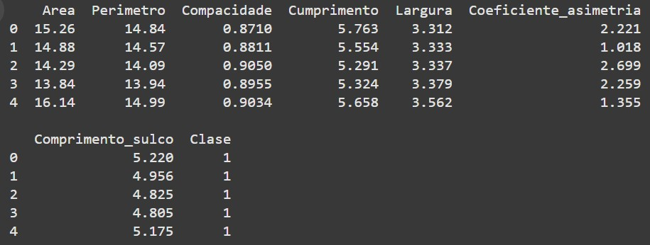
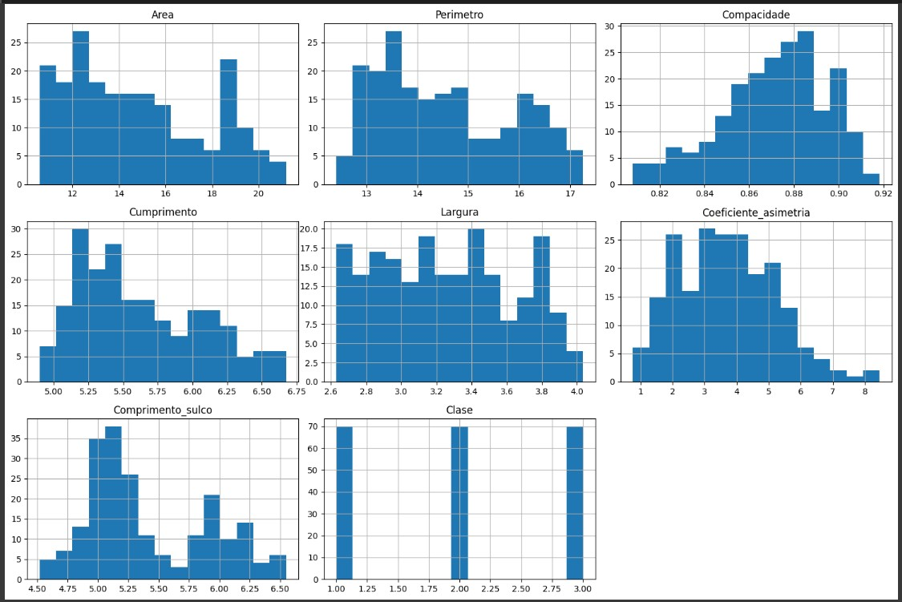
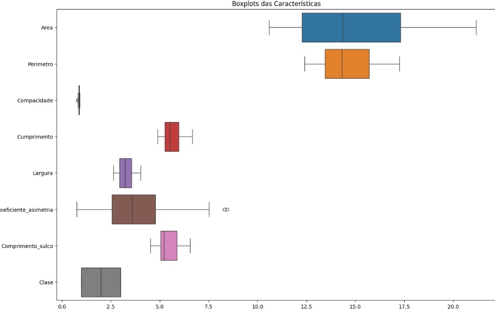
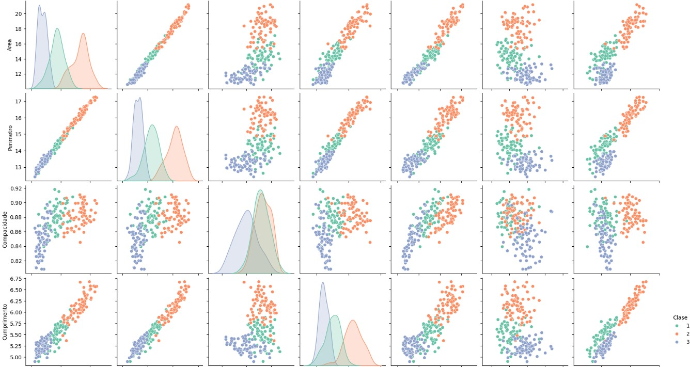
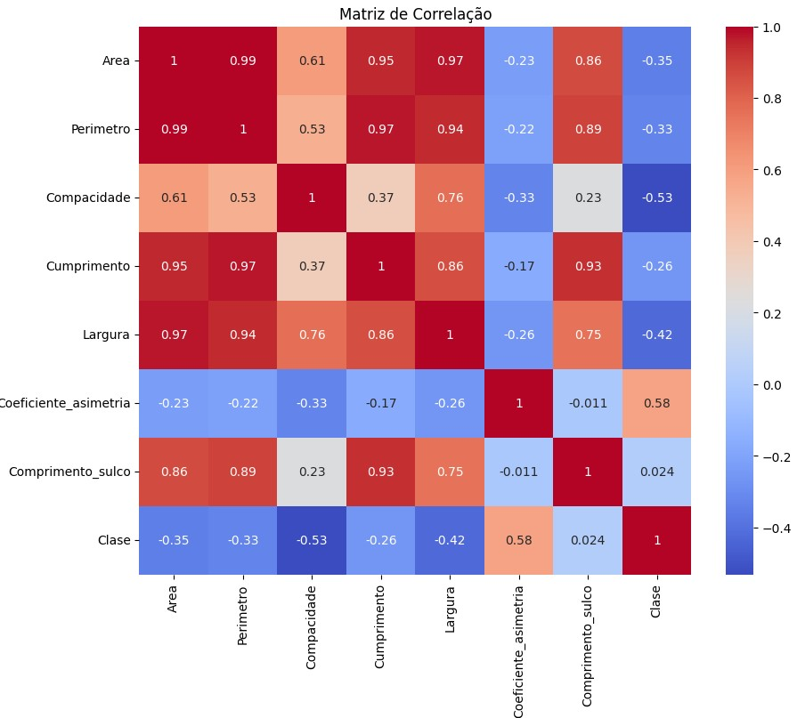
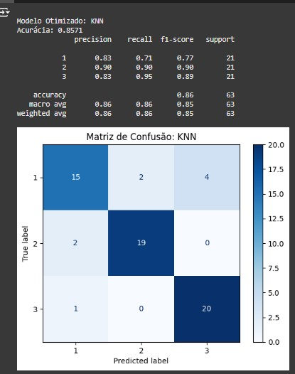
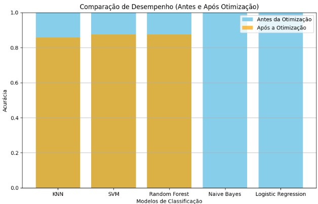

# FIAP - Faculdade de Informática e Administração Paulista

 

# ATIVIDADE – Da Terra ao Código: Automatizando a Classificação de Grãos com Machine Learning

# Nome do projeto
Fase 4 - Cap 3 - Implementando algoritmos de Machine Learning com Scikit-learn

## Nome do grupo
Grupo 66

## 👨‍🎓 Integrantes: 
- <a href="https://www.linkedin.com/in/">Ana Beatriz Duarte Domingues</a>
- <a href="https://www.linkedin.com/in/jrsilva051/">Junior Rodrigues da Silva</a>
- <a href="https://www.linkedin.com/in/">Carlos Emilio Castillo Estrada</a>

## 👩‍🏫 Professores:
### Tutor(a) 
- <a href="https://www.linkedin.com/company/inova-fusca">Lucas Gomes Moreira</a>
### Coordenador(a)
- <a href="https://www.linkedin.com/company/inova-fusca">André Godoi Chiovato</a>

## 📜 Descrição
Desenvolvimento de um modelo de aprendizado de máquina capaz de classificar diferentes variedades de trigo com base em suas características físicas, automatizando um processo que, nas cooperativas agrícolas, é realizado manualmente. A data para analisar e um dataset que foi descarregado no link: <a href="https://archive.ics.uci.edu/dataset/236/seeds">https://archive.ics.uci.edu/dataset/236/seeds</a>

As atividades incluem:
- Aplicar a metodologia CRISP-DM para desenvolver um modelo de aprendizado de máquina que classifique variedades de grãos de trigo com base em suas características físicas.
- Analisar e pré-processar os dados fornecidos.
- Implementar e comparar diferentes algoritmos de classificação.
- Otimizar os modelos para melhorar o desempenho.
 

## 📸 Imagens da Análise da Informação
### Exibir as primeiras linhas do dataset para revisão inicial 

  

  <strong>Figura 1:</strong> Estatística Descritiva

### Histograma dos atributos (Informação do dataset)

  

  <strong>Figura 2:</strong> Histograma dos Atributos

### Boxplots das Caraterísticas

  

  <strong>Figura 3:</strong> Boxplots das Caraterísticas

### Dispersão das variedades de semente pelas características

  

  <strong>Figura 4:</strong> Dispersão das variedades de semente pelas características

### Matriz de correlação pelas características

  

  <strong>Figura 4:</strong> Matriz de correlação pelas características

### Matriz de confusão

  

  <strong>Figura 4:</strong> Matriz de confusão

### Comparação de Desempenho

  

  <strong>Figura 4:</strong> Comparação de Desempenho

## 📁 Estrutura de pastas

Dentre os arquivos e pastas presentes na raiz do projeto, definem-se:

- <b>.github</b>: Nesta pasta ficarão os arquivos de configuração específicos do GitHub que ajudam a gerenciar e automatizar processos no repositório.

- <b>assets</b>: aqui estão os arquivos relacionados a elementos não-estruturados deste repositório, como imagens.

- <b>config</b>: Posicione aqui arquivos de configuração que são usados para definir parâmetros e ajustes do projeto.

- <b>document</b>: aqui estão todos os documentos do projeto que as atividades poderão pedir. Na subpasta "other", adicione documentos complementares e menos importantes.

- <b>scripts</b>: Posicione aqui scripts auxiliares para tarefas específicas do seu projeto. Exemplo: deploy, migrações de banco de dados, backups.

- <b>src</b>: Todo o código fonte criado para o desenvolvimento do projeto ao longo das 7 fases.

- <b>README.md</b>: arquivo que serve como guia e explicação geral sobre o projeto (o mesmo que você está lendo agora).

## 🔧 Como executar o código
### 💼 Pré-requisitos
Antes de iniciar, certifique-se de que você tem:

1. Python instalado, recomenda-se a versão 3.8 ou superior.
2. As bibliotecas necessárias: 'numpy', 'pandas', 'matplotlib', 'seaborn', 'streamlit', 'scikit-learn' e 'mysql-connector-python'.
   

### 🚀 Passo a Passo

### 🎥 Vídeo Demonstrativo 
O vídeo demonstrativo do projeto, está disponível no YouTube.
LINK

## 🗃 Histórico de lançamentos

* 0.1.0 - 03/12/2024
    *

## 📋 Licença

<a property="dct:title" rel="cc:attributionURL" href="https://github.com/agodoi/template">MODELO GIT FIAP</a> por <a rel="cc:attributionURL dct:creator" property="cc:attributionName" href="https://fiap.com.br">Fiap</a> está licenciado sobre <a href="http://creativecommons.org/licenses/by/4.0/?ref=chooser-v1" target="_blank" rel="license noopener noreferrer" style="display:inline-block;">Attribution 4.0 International</a>.

